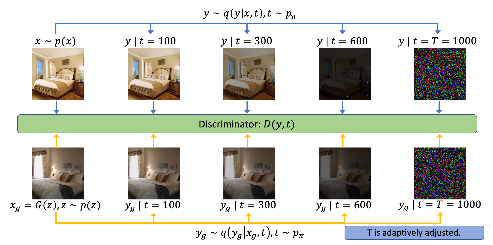

## Diffusion-GAN &mdash; Official PyTorch implementation



**Diffusion-GAN: Training GANs with Diffusion**<br>
Zhendong Wang, Huangjie Zheng, Pengcheng He, Weizhu Chen and Mingyuan Zhou <br>
https://arxiv.org/abs/2206.02262 <br>

Abstract: *For stable training of generative adversarial networks (GANs), injecting instance
noise into the input of the discriminator is considered as a theoretically sound
solution, which, however, has not yet delivered on its promise in practice. This
paper introduces Diffusion-GAN that employs a Gaussian mixture distribution,
defined over all the diffusion steps of a forward diffusion chain, to inject instance
noise. A random sample from the mixture, which is diffused from an observed
or generated data, is fed as the input to the discriminator. The generator is
updated by backpropagating its gradient through the forward diffusion chain,
whose length is adaptively adjusted to control the maximum noise-to-data ratio
allowed at each training step. Theoretical analysis verifies the soundness of the
proposed Diffusion-GAN, which provides model- and domain-agnostic differentiable
augmentation. A rich set of experiments on diverse datasets show that DiffusionGAN can 
provide stable and data-efficient GAN training, bringing consistent
performance improvement over strong GAN baselines for synthesizing photorealistic images.*

[](https://paperswithcode.com/sota/image-generation-on-stl-10?p=diffusion-gan-training-gans-with-diffusion)
[](https://paperswithcode.com/sota/image-generation-on-lsun-bedroom-256-x-256?p=diffusion-gan-training-gans-with-diffusion)
[](https://paperswithcode.com/sota/image-generation-on-afhq?p=diffusion-gan-training-gans-with-diffusion)
[](https://paperswithcode.com/sota/image-generation-on-lsun-churches-256-x-256?p=diffusion-gan-training-gans-with-diffusion)
[](https://paperswithcode.com/sota/image-generation-on-ffhq?p=diffusion-gan-training-gans-with-diffusion)

## ToDos
- [x] Initial code release
- [x] Providing pretrained models

## Build your Diffusion-GAN
Here, we explain how to train general GANs with diffusion. We provide two ways: 
a. plug-in as simple as a data augmentation method; 
b. training GANs on diffusion chains with a timestep-dependent discriminator. 
Currently, we didn't find significant empirical differences of the two approaches, 
while the second approach has stronger theoretical guarantees. We suspect when advanced timestep-dependent structure is applied in the discriminator,
the second approach could become better, and we left that for future study. 

### Simple Plug-in
* Design a proper diffusion process based on the ```diffusion.py``` file
* Apply diffusion on the inputs of discriminators, 
```logits = Discriminator(Diffusion(gen/real_images))```
* Add adaptiveness of diffusion into your training iterations
``` 
if update_diffusion:  # batch_idx % ada_interval == 0
    adjust = np.sign(sign(Discriminator(real_images)) - ada_target) * C  # C = (batch_size * ada_interval) / (ada_kimg * 1000)
    diffusion.p = (diffusion.p + adjust).clip(min=0., max=1.)
    diffusion.update_T()
```

### Full Version
* Add diffusion timestep `t` as an input for discriminators `logits = Discriminator(images, t)`. 
You may need some modifications in your discriminator architecture. 
* The other steps are the same as Simple Plug-in. Note that since discriminator depends on timesteps, 
you need to collect `t`.
```
diffused_images, t = Diffusion(images)
logits = Discrimnator(diffused_images, t)
```

## Train our Diffusion-GAN

### Requirements
* 64-bit Python 3.7 and PyTorch 1.7.1/1.8.1. See [https://pytorch.org/](https://pytorch.org/) for PyTorch install instructions.
* CUDA toolkit 11.0 or later. 
* Python libraries: `pip install click requests tqdm pyspng ninja imageio-ffmpeg==0.4.3`.

### Data Preparation

In our paper, we trained our model on [CIFAR-10 (32 x 32)](https://www.cs.toronto.edu/~kriz/cifar.html), [STL-10 (64 x 64)](https://cs.stanford.edu/~acoates/stl10/),
[LSUN (256 x 256)](https://github.com/fyu/lsun), [AFHQ (512 x 512)](https://github.com/clovaai/stargan-v2) and [FFHQ (1024 x 1024)](https://github.com/NVlabs/ffhq-dataset).
You can download the datasets we used in our paper at their respective websites. 
To prepare the dataset at the respective resolution, run for example
```.bash
python dataset_tool.py --source=~/downloads/lsun/raw/bedroom_lmdb --dest=~/datasets/lsun_bedroom200k.zip \
    --transform=center-crop --width=256 --height=256 --max_images=200000

python dataset_tool.py --source=~/downloads/lsun/raw/church_lmdb --dest=~/datasets/lsun_church200k.zip \
    --transform=center-crop-wide --width=256 --height=256 --max_images=200000
```

### Training

We show the training commands that we used below. In most cases, the training commands are similar, so below we use CIFAR-10 dataset
as an example: 

For Diffusion-GAN,
```.bash
python train.py --outdir=training-runs --data="~/cifar10.zip" --gpus=4 --cfg cifar --kimg 50000 --aug no --target 0.6 --noise_sd 0.05 --ts_dist priority
```
For Diffusion-GAN + DIFF, 
```.bash
python train.py --outdir=training-runs --data="~/cifar10.zip" --gpus=4 --cfg cifar --kimg 50000 --aug diff --target 0.6 --noise_sd 0.05 --ts_dist priority
```
For Diffusion-GAN + ADA, 
```.bash
python train.py --outdir=training-runs --data="~/cifar10.zip" --gpus=4 --cfg cifar --kimg 50000 --aug ada --ada_maxp 0.25 --target 0.6 --noise_sd 0.05 --ts_dist priority
```
For Diffusion-ProjectedGAN
```.bash
python train.py --outdir=training-runs --data="~/cifar10.zip" --gpus=4 --cfg cifar --kimg 50000 --target 0.45 --d_pos first --noise_sd 0.5
```
We follows the `config` setting from [StyleGAN2-ADA](https://github.com/NVlabs/stylegan2-ada-pytorchhttps://github.com/NVlabs/stylegan2-ada-pytorch) 
and refer to them for more details. The other major hyperparameters are listed and discussed below:
* `--target` the discriminator target, which balances the level of diffusion intensity.
* `--aug` domain-specific image augmentation, such as ADA and Differentiable Augmentation, which is used for evaluate complementariness with diffusion. 
* `--noise_sd` diffusion noise standard deviation, which is set as 0.05 in our case.
* ` --ts_dist` t sampling distribution, $\pi(t)$ in paper. 

We evaluated two `t` sampling distribution `['priority', 'uniform']`,
where `'priority'` denotes the Equation (11) in paper and `'uniform'` denotes random sampling. In most cases, `priority` works slightly better, while in some cases, such as FFHQ,
`'uniform'` is better. 

## Sampling and Evaluation with our checkpoints
We provide our Diffusion-GAN checkpoints below:

| Model |   Dataset    | Resolution |  FID  | model |
|:---:|:------------:|:---:|:-----:| :---:|
| Diffusion-StyleGAN2 |   CIFAR-10   | 32x32 | 3.19  | [download](https://tsciencescu.blob.core.windows.net/projectshzheng/DiffusionGAN/diffusion-stylegan2-cifar10.pkl) |
| Diffusion-StyleGAN2-DiffAug |   CIFAR-10   | 32x32 | 2.92  | [download](https://tsciencescu.blob.core.windows.net/projectshzheng/DiffusionGAN/diffusion-stylegan2-diffaug-cifar10.pkl) |
| Diffusion-StyleGAN2-ADA |   CIFAR-10   | 32x32 | 2.67  | [download](https://tsciencescu.blob.core.windows.net/projectshzheng/DiffusionGAN/diffusion-stylegan2-ada-cifar10.pkl) |
| Diffusion-StyleGAN2 |    STL-10    | 64x64 | 11.53 | [download](https://tsciencescu.blob.core.windows.net/projectshzheng/DiffusionGAN/diffusion-stylegan2-stl10.pkl) |
| Diffusion-StyleGAN2-DiffAug |    STL-10    | 64x64 | 13.00 | [download](https://tsciencescu.blob.core.windows.net/projectshzheng/DiffusionGAN/diffusion-stylegan2-diffaug-stl10.pkl) |
| Diffusion-StyleGAN2-ADA |    STL-10    | 64x64 | 14.51 | [download](https://tsciencescu.blob.core.windows.net/projectshzheng/DiffusionGAN/diffusion-stylegan2-ada-stl10.pkl) |
| Diffusion-StyleGAN2 | LSUN-Bedroom | 256x256 | 3.65  | [download](https://tsciencescu.blob.core.windows.net/projectshzheng/DiffusionGAN/diffusion-stylegan2-lsun-bedroom.pkl) |
| Diffusion-StyleGAN2-DiffAug | LSUN-Bedroom | 256x256 | 5.07  | [download](https://tsciencescu.blob.core.windows.net/projectshzheng/DiffusionGAN/diffusion-stylegan2-diffaug-lsun-bedroom.pkl) |
| Diffusion-StyleGAN2-ADA | LSUN-Bedroom | 256x256 | 3.95  | [download](https://tsciencescu.blob.core.windows.net/projectshzheng/DiffusionGAN/diffusion-stylegan2-ada-lsun-bedroom.pkl) |
| Diffusion-ProjectedGAN | LSUN-Bedroom | 256x256 | 1.43  | [download](https://tsciencescu.blob.core.windows.net/projectshzheng/DiffusionGAN/diffusion-projectedgan-lsun-bedroom.pkl) |
| Diffusion-StyleGAN2 | LSUN-Church  | 256x256 | 3.17  | [download](https://tsciencescu.blob.core.windows.net/projectshzheng/DiffusionGAN/diffusion-stylegan2-lsun-church.pkl) |
| Diffusion-StyleGAN2-DiffAug | LSUN-Church  | 256x256 | 4.88  | [download](https://tsciencescu.blob.core.windows.net/projectshzheng/DiffusionGAN/diffusion-stylegan2-diffaug-lsun-church.pkl) |
| Diffusion-StyleGAN2-ADA | LSUN-Church  | 256x256 | 3.38  | [download](https://tsciencescu.blob.core.windows.net/projectshzheng/DiffusionGAN/diffusion-stylegan2-ada-lsun-church.pkl) |
| Diffusion-ProjectedGAN | LSUN-Church  | 256x256 | 1.85  | [download](https://tsciencescu.blob.core.windows.net/projectshzheng/DiffusionGAN/diffusion-projectedgan-lsun-church.pkl) |
| Diffusion-StyleGAN2 |     AFHQ     | 512x512 | 5.86  | [download](https://tsciencescu.blob.core.windows.net/projectshzheng/DiffusionGAN/diffusion-stylegan2-afhq.pkl) |
| Diffusion-StyleGAN2-DiffAug |     AFHQ     | 512x512 | 6.63  | [download](https://tsciencescu.blob.core.windows.net/projectshzheng/DiffusionGAN/diffusion-stylegan2-diffaug-afhq.pkl) |
| Diffusion-StyleGAN2-ADA |     AFHQ     | 512x512 | 4.73  | [download](https://tsciencescu.blob.core.windows.net/projectshzheng/DiffusionGAN/diffusion-stylegan2-ada-afhq.pkl) |
| Diffusion-StyleGAN2 |     FFHQ     | 1024x1024 | 2.83  | [download](https://tsciencescu.blob.core.windows.net/projectshzheng/DiffusionGAN/diffusion-stylegan2-ffhq.pkl) |
| Diffusion-StyleGAN2-DiffAug |     FFHQ     | 1024x1024 | 3.82  | [download](https://tsciencescu.blob.core.windows.net/projectshzheng/DiffusionGAN/diffusion-stylegan2-diffaug-ffhq.pkl) |
| Diffusion-StyleGAN2-ADA |     FFHQ     | 1024x1024 | 3.51  | [download](https://tsciencescu.blob.core.windows.net/projectshzheng/DiffusionGAN/diffusion-stylegan2-ada-ffhq.pkl) |

To generate samples, run the following commands:

```.bash
# Generate FFHQ with pretrained Diffusion-StyleGAN2
python generate.py --outdir=out --seeds=1-100 \
    --network=https://tsciencescu.blob.core.windows.net/projectshzheng/DiffusionGAN/diffusion-stylegan2-ffhq.pkl

# Generate LSUN-Church with pretrained Diffusion-ProjectedGAN
python generate.py --outdir=out --seeds=1-100 \
    --network=https://tsciencescu.blob.core.windows.net/projectshzheng/DiffusionGAN/diffusion-projectedgan-lsun-church.pkl
```

The checkpoints can be replaced with any pre-trained Diffusion-GAN checkpoint path downloaded from the table above.


Similarly, the metrics can be calculated with the following commands:

```.bash
# Pre-trained network pickle: specify dataset explicitly, print result to stdout.
python calc_metrics.py --metrics=fid50k_full --data=~/datasets/ffhq.zip --mirror=1 \
    --network=https://tsciencescu.blob.core.windows.net/projectshzheng/DiffusionGAN/diffusion-stylegan2-ffhq.pkl
```

## Citation

```
@InProceedings{wang2022diffusiongan,
  author    = {Wang, Zhendong and Zheng, Huangjie and He, Pengcheng and Chen, Weizhu and Zhou, Mingyuan},
  title     = {Diffusion-GAN: Training GANs with Diffusion},
  journal   = {arXiv.org},
  volume    = {abs/2206.02262},
  year      = {2022},
  url       = {https://arxiv.org/abs/2206.02262},
}
```

## Acknowledgements

Our code builds upon the awesome [StyleGAN2-ADA repo](https://github.com/NVlabs/stylegan2-ada-pytorch) and [ProjectedGAN repo](https://github.com/autonomousvision/projected_gan), respectively by Karras et al and Axel Sauer et al.
